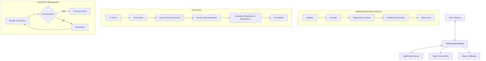

## WebSocketEventBus Architecture

The WebSocketEventBus is a key architectural component that enables 
real-time communication between the frontend application and the 
backend server. It implements the EventBus interface providing a 
standardized way for components to communicate.



### Features

- **Bidirectional Communication**: Real-time data flow between client 
and server
- **Event-Based Architecture**: Publish-subscribe pattern for flexible 
component communication
- **Connection State Management**: Automatic handling of connection 
status with reconnection logic
- **Targeted Event Distribution**: Events are routed to specific 
subscribers based on type
- **Autonomous Mode Support**: Specialized handling for autonomous 
agent operations

### Implementation Details

- The `EventBus` interface defines the contract for all event 
communication
- `WebSocketEventBus` implements this interface with WebSocket-specific 
functionality
- Connection status is tracked with states: 'connecting', 'connected', 
'disconnected', 'error'
- Events are distributed to subscribers based on type matching
- The implementation handles reconnection, error recovery, and message 
parsing

### Usage Example

```typescript
// Initialize with WebSocket URL
const eventBus = new WebSocketEventBus('ws://localhost:3001');

// Subscribe to events
eventBus.subscribe('agent-message', (data) => {
  console.log('Received message:', data);
  // Update UI with message
});

// Monitor connection status
eventBus.onConnectionStatusChange((status) => {
  console.log(`Connection status: ${status}`);
  // Update UI to show connection status
});

// Send a command to the server
eventBus.emit('command', {
  type: 'command',
  command: 'start',
  settings: {
    aiProvider: 'openai',
    enablePrivateCompute: false
  }
});
```

The agents handles complex operations like portfolio rebalancing by:

- Breaking down operations into discrete tasks
- Executing them in the correct order
- Handling failures and retries
- Providing real-time status updates

This makes the agents more robust and capable of handling complex DeFi 
operations in a reliable, monitored way.
