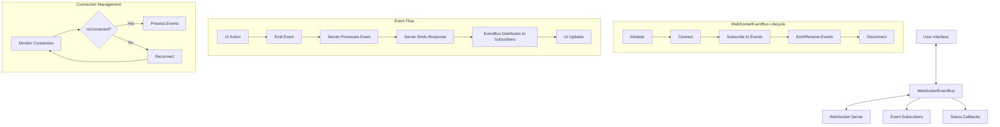

- Users can manage their defi portfolio with their risk parameters and 
portfolio balance
- Provides real-time feedback and execution status

## WebSocketEventBus Architecture

The WebSocketEventBus is a key architectural component that enables 
real-time communication between the frontend application and the 
backend server. It implements the EventBus interface providing a 
standardized way for components to communicate.



### Features

- **Bidirectional Communication**: Real-time data flow between client 
and server
- **Event-Based Architecture**: Publish-subscribe pattern for flexible 
component communication
- **Connection State Management**: Automatic handling of connection 
status with reconnection logic
- **Targeted Event Distribution**: Events are routed to specific 
subscribers based on type
- **Autonomous Mode Support**: Specialized handling for autonomous 
agent operations

### Implementation Details

- The `EventBus` interface defines the contract for all event 
communication
- `WebSocketEventBus` implements this interface with WebSocket-specific 
functionality
- Connection status is tracked with states: 'connecting', 'connected', 
'disconnected', 'error'
- Events are distributed to subscribers based on type matching
- The implementation handles reconnection, error recovery, and message 
parsing

### Usage Example

```typescript
// Initialize with WebSocket URL
const eventBus = new WebSocketEventBus('ws://localhost:3001');

// Subscribe to events
eventBus.subscribe('agent-message', (data) => {
  console.log('Received message:', data);
  // Update UI with message
});

// Monitor connection status
eventBus.onConnectionStatusChange((status) => {
  console.log(`Connection status: ${status}`);
  // Update UI to show connection status
});

// Send a command to the server
eventBus.emit('command', {
  type: 'command',
  command: 'start',
  settings: {
    aiProvider: 'openai',
    enablePrivateCompute: false
  }
});
```

The agents handles complex operations like portfolio rebalancing by:

- Breaking down operations into discrete tasks
- Executing them in the correct order
- Handling failures and retries
- Providing real-time status updates

This makes the agents more robust and capable of handling complex DeFi 
operations in a reliable, monitored way.


## 📋 Example Use Cases

```markdown
## 📋 Example Use Cases

### 1. Portfolio Optimization
```text
User: "I have 10 AVAX and want to optimize my portfolio between 
lending, liquidity provision, and trading. What's the best strategy 
right now?"

Agent Collaboration Flow:
1. Portfolio Manager analyzes request and current market conditions
2. DeFi Analytics Agent provides real-time data:
   - Aave AVAX lending APY: 1.77%
   - Uniswap AVAX-USDC pool APR: 43.893%
   - Curve Blizz pool APY: 1.58%
   - DeFi TVL trend: +5% weekly
3. Trading Agent evaluates market opportunities
4. Liquidity Agent assesses pool stability
5. Portfolio Manager provides final allocation strategy
```

### 2. Risk-Managed Yield Farming
```text
User: "Find me the highest yield opportunities while maintaining 
moderate risk levels"

Agent Collaboration Flow:
1. Portfolio Manager evaluates risk parameters
2. DeFi Analytics Agent scans protocols:
   - Protocol TVL analysis
   - Smart contract audit status
   - Historical yield stability
3. Risk Assessment Agent performs:
   - Protocol risk scoring
   - Impermanent loss calculation
   - Market volatility analysis
4. Final recommendation with risk-adjusted returns
```

### 3. Multi-Protocol Optimization
```text
User: "Distribute 5000 USDC across lending platforms for the best 
risk-adjusted returns"

Agent Collaboration Flow:
1. DeFi Analytics Agent scans lending markets:
   - Protocol-specific APYs
   - Total deposits
   - Utilization rates
2. Risk Agent evaluates:
   - Protocol security
   - Market conditions
   - Collateral factors
3. Portfolio Manager executes:
   - Optimal distribution
   - Position monitoring
   - Auto-rebalancing setup
```

### 4. Smart Rebalancing
```text
User: "Monitor and rebalance my portfolio to maintain 40% AVAX, 30% 
ETH, 30% stables"

Agent Collaboration Flow:
1. Portfolio Manager tracks allocations
2. Trading Agent monitors:
   - Price movements
   - Trading volumes
   - Market depth
3. DeFi Analytics provides:
   - Gas optimization data
   - Slippage estimates
   - Best execution routes
4. Automated rebalancing when:
   - Deviation exceeds 5%
   - Gas costs are optimal
   - Market conditions favorable


### 5. Yield Optimization
```text
User: "Optimize my stablecoin yields while maintaining 50% USDC and 50% 
USDT split"

Agent will:
1. Analyze current positions
2. Scout highest yield opportunities
3. Execute necessary swaps
4. Deploy to optimal protocols
5. Maintain stability ratio
```

### 6. Portfolio Rebalancing
```text
User: "Rebalance my portfolio to 30% ETH, 30% AVAX, and 40% stables"

Agent will:
1. Calculate required trades
2. Find optimal execution paths
3. Execute trades in optimal order
4. Confirm final allocations
5. Report completion
```

### 7. Cross-Chain Management
```text
User: "Bridge 1000 USDC from Ethereum to Avalanche and deploy to 
highest yield"

Agent will:
1. Initiate bridge transaction
2. Monitor bridge status
3. Receive funds on Avalanche
4. Research yield opportunities
5. Deploy to best protocol
```

8. Yield Optimization
```plaintext
User: "Optimize my portfolio for maximum yield while maintaining 30% in 
stablecoins"

Agent will:
1. Analyze current holdings
2. Identify highest yield opportunities
3. Calculate optimal allocations
4. Execute required swaps
5. Deploy capital to yield protocols
6. Maintain stability ratio
```

### 9. Risk Management
```plaintext
User: "Reduce portfolio risk and move to defensive positions"

Agent will:
1. Evaluate current risk metrics
2. Identify high-risk positions
3. Plan exit strategies
4. Execute position closures
5. Reallocate to stable assets
6. Confirm risk reduction
```

### 10. Market Opportunity
```plaintext
User: "Take advantage of AVAX price dip with 20% of portfolio"

Agent will:
1. Check current AVAX price
2. Calculate optimal entry points
3. Identify assets to swap
4. Execute Defi Transactions

### 11. Starknet Portfolio Management
```text
User: "Deploy and manage my meme token portfolio on Starknet with 
unruggable features"

Agent Collaboration Flow:
1. Portfolio Manager analyzes Starknet opportunities:
   - Unruggable meme token protocols
   - Cairo-based DeFi platforms
   - Cross-L2 bridges (Starkgate)

2. DeFi Analytics Agent provides Starknet data:
   - Jediswap liquidity pools
   - Ekubo AMM metrics
   - zkLend lending rates
   - Cross-L2 bridge volumes

3. Risk Assessment Agent evaluates:
   - Smart contract security (Cairo 1.0)
   - Protocol TVL stability
   - Bridge security
   - Token distribution metrics

4. Execution Flow:
   - Deploy using Starknet.js/Starknet React
   - Integrate with Argent X/Braavos wallet
   - Monitor via Starkscan/Voyager
   - Auto-rebalance using Cairo contracts
